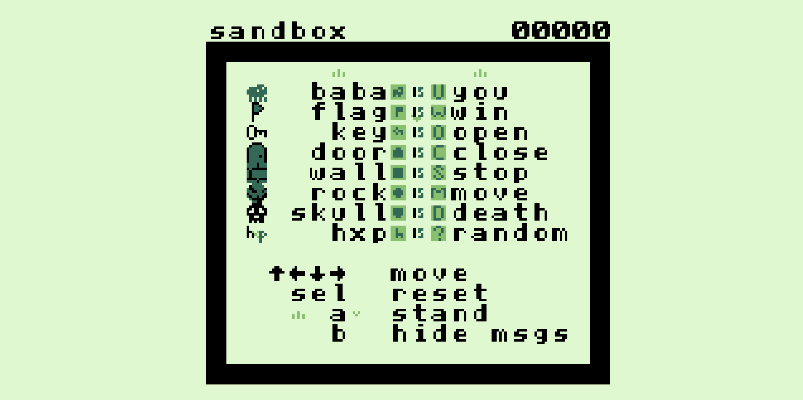

# gameboy is you

A gameboy || challenge for the [hxp CTF 2021](https://2021.ctf.link/internal/challenge/52c2a607-7e05-456f-b8c0-68952304f2a4/) heavily inspired by [baba is you](https://hempuli.com/baba/).

To see the solution with the supplied tas-emulator, please run `./tas-emulator -s 2 playback replay`.

A writeup of how to solve it is here: [writeup](writeup).
