# baba is you

The game starts with a sandbox level, so you can play around with the rules and get familiar. It's also a good time to look at the memory.

## Data structure

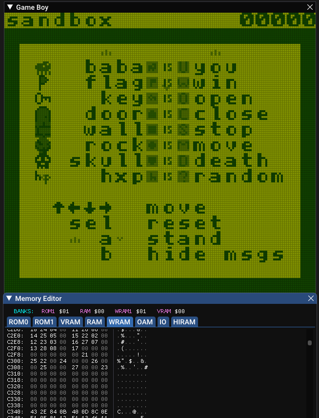
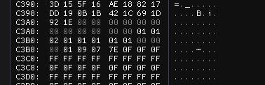

Specifically let's look at 0xC2FD. There the array of "you"-objects starts => 0x21 is "baba". At 0xC3AE you can see how many baba objects exist. Following, on 0xC300, there are the "stop"-objects. You can see that there are 2 stop objects, even though there is only one rule for stop.

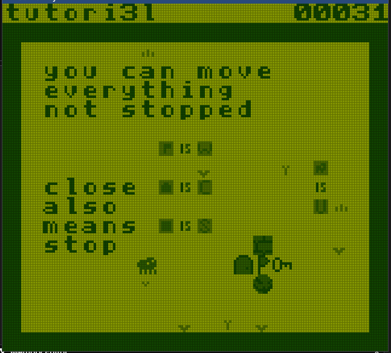

The reason for this is explained in tutori3l. "close" also means "stop". That's the reason we have both objects, 0x25 (door) and 0x24 (wall) in the stop array. All arrays in order:

| Array  | Objects | Amount |
|--------|---------|--------|
| 0xC2FD | you     | 0xC3AF |
| 0xC300 | stop    | 0xC3B0 |
| 0xC303 | win     | 0xC3B1 |
| 0xC306 | open    | 0xC3B2 |
| 0xC309 | close   | 0xC3B3 |
| 0xC30C | kill    | 0xC3B4 |
| 0xC30F | move    | 0xC3B5 |

The tutorial levels are explaining some inner workings like the "close" - "stop" relationship. I'll explain the logic of the first few levels now:

## wr0ng

| | |
|-|-|
| 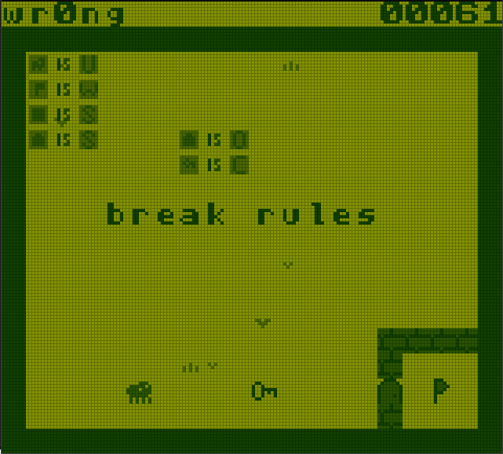 | 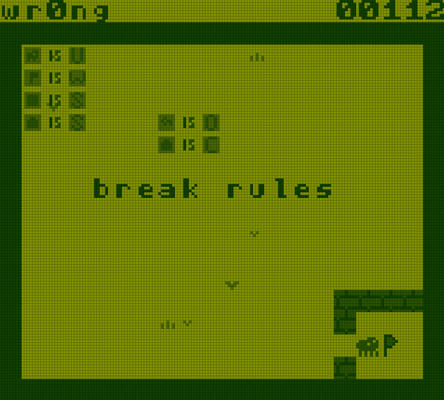 |

Switch the rules of key and door.

## mnm1

| | |
|-|-|
| 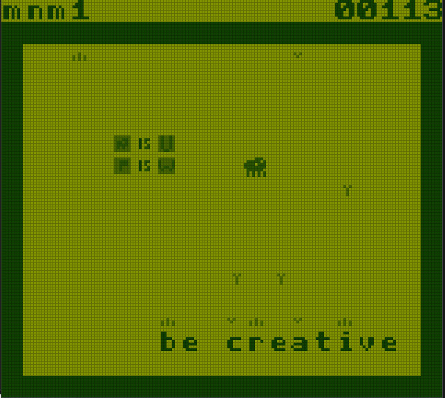 | 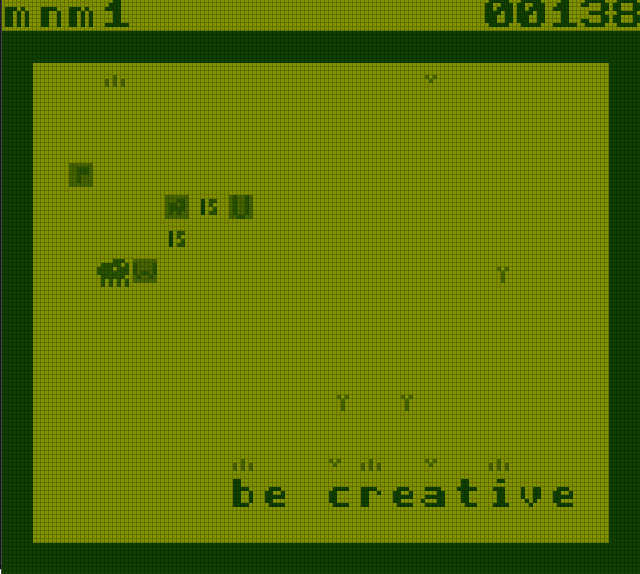 |

Set baba to you and win at the same time.

## sacrifi2e

| | |
|-|-|
|  | 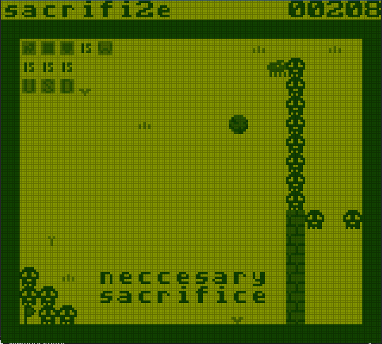 |

First of all, sorry for the typo -.-.

Break the bottom wall with the bouldern, then move the text to the top and break the left wall with the flag-symbol. Set skull to win and run into the win. Win is checked before death, therefore this works.

## d3ath

| | | |
|-|-|-|
| 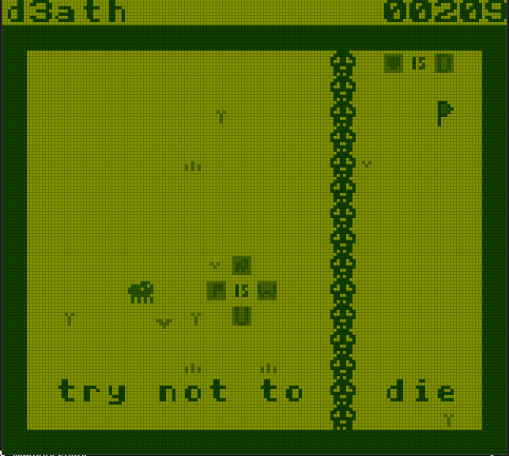 | 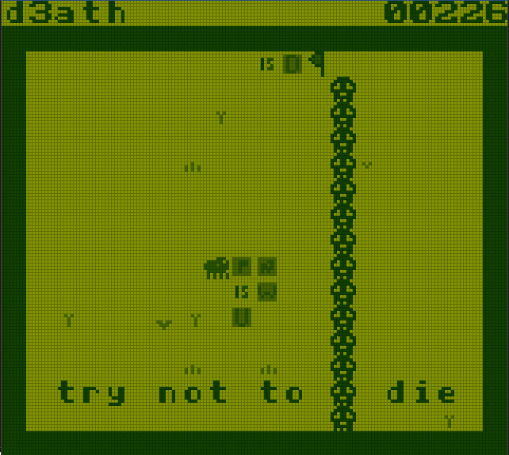 | 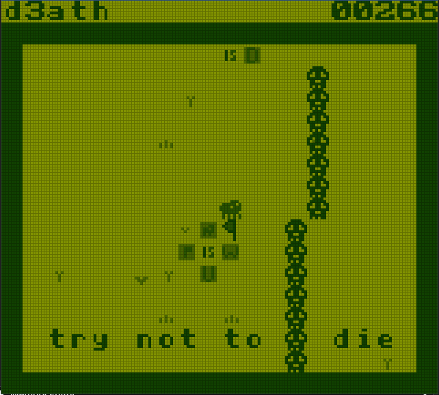 |

Set flag-is-you, push the text into the skull-wall. Change the rules back to baba-is-you and flag-is-win.

I also pushed a few skulls to the right. More explanation later.

## mi5sing

| | |
|-|-|
| 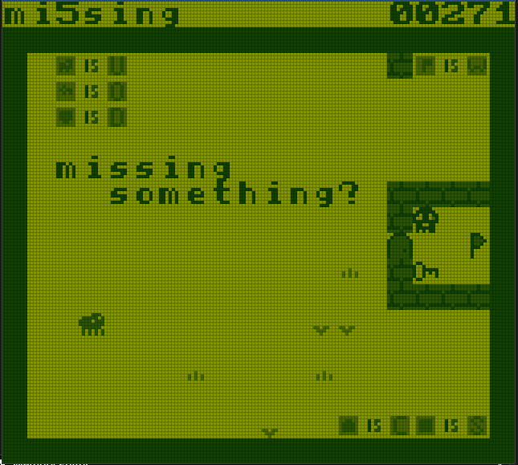 | 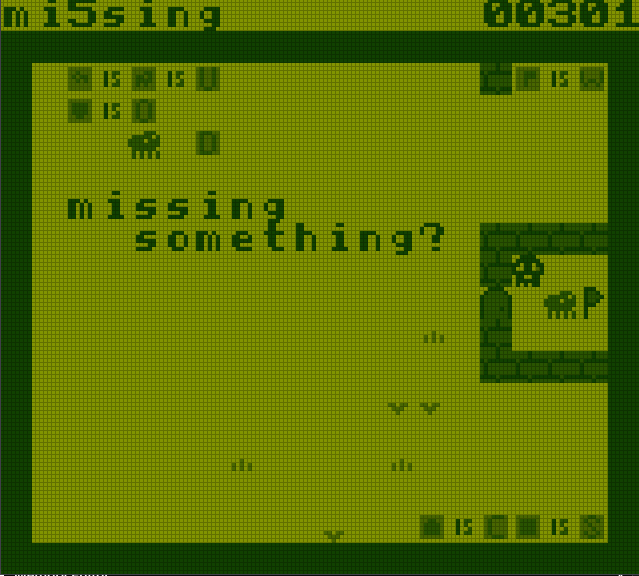 |

I'm missing level 4 :(

But also the key to open the door ... Push baba-is-you to the right, and create key-is-baba. Now you control a character in the vault.

## messin6

| | |
|-|-|
| 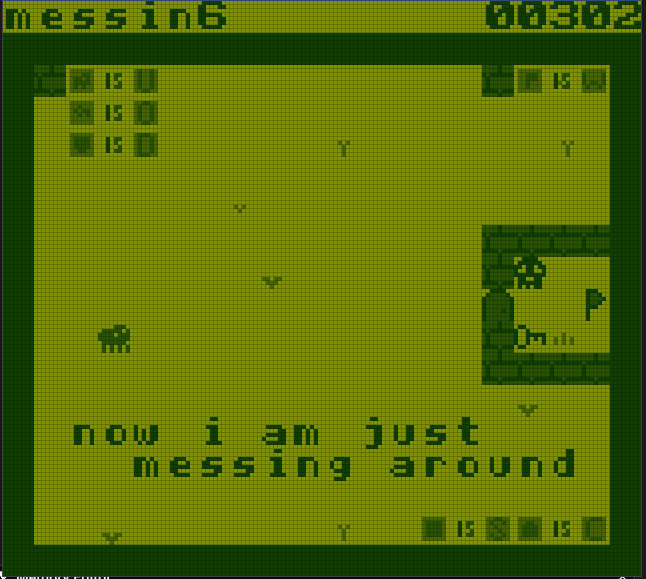 | 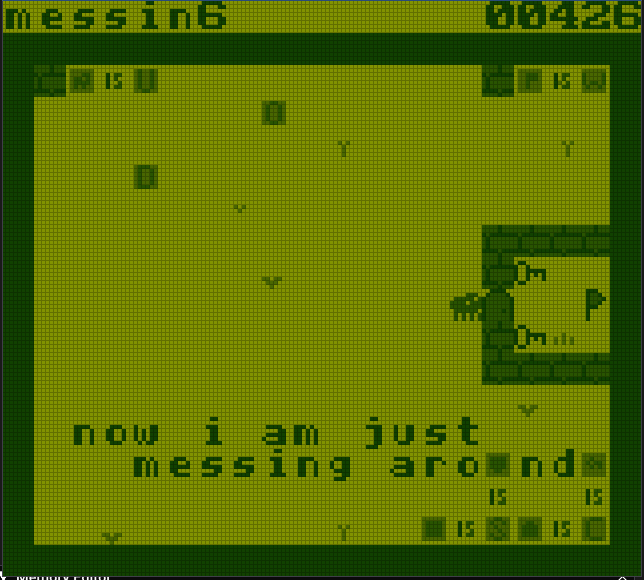 |

Now the fun begins. The option to move baba-is-you to the right is removed.

The object-arrays have all length 3 and "win" is located after "stop". We have door and wall already set to stop and two other rules which we can manipulate.

By putting key-is and skull-is above close and stop, we overflow the 3 byte array for stop into the win array setting door to win. Now when running into the door, you win.

## mov7ng

| | | |
|-|-|-|
| 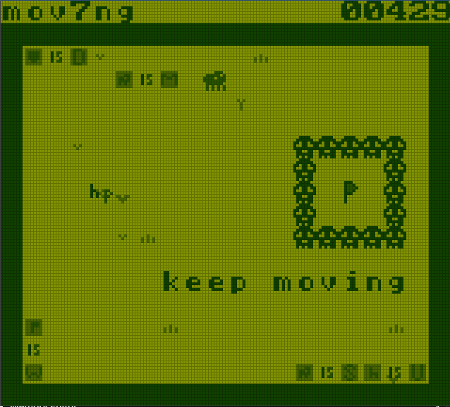 | 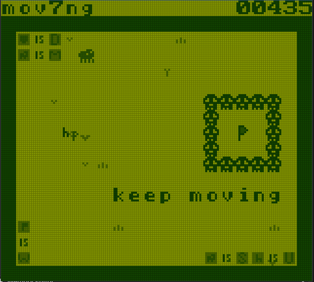 |  |

Baba runs to the left, blocking the use of any rule int he map. After it hits the wall, it moves to the right. The moving direction is not updated by a reload, so if we reload now, baba will maintain its movement direction to the right giving us enough time to break the rule giving us a piece to destroy a skull.

## c8llision

| | |
|-|-|
| 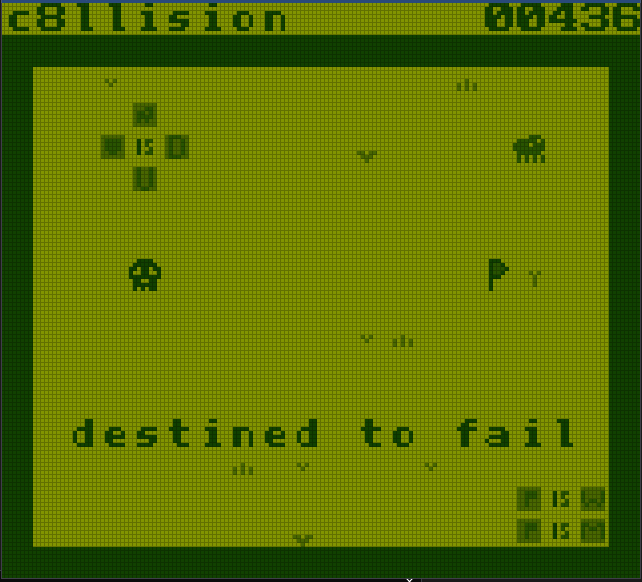 | 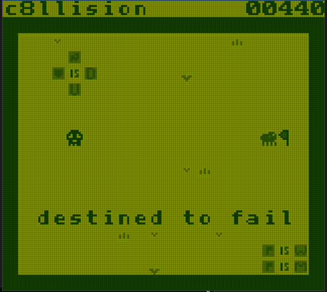 |

As stated before, the movement direction is only updated when the object hits a wall or is moved. The moving flag in this level has the internal id of 7, which coincidentally is also the id of one of the skulls we moved to the right in **d3ath**. This causes the flag to move to the right instead of left and gives us the chance to stop it from getting destroyed.

## ran9om

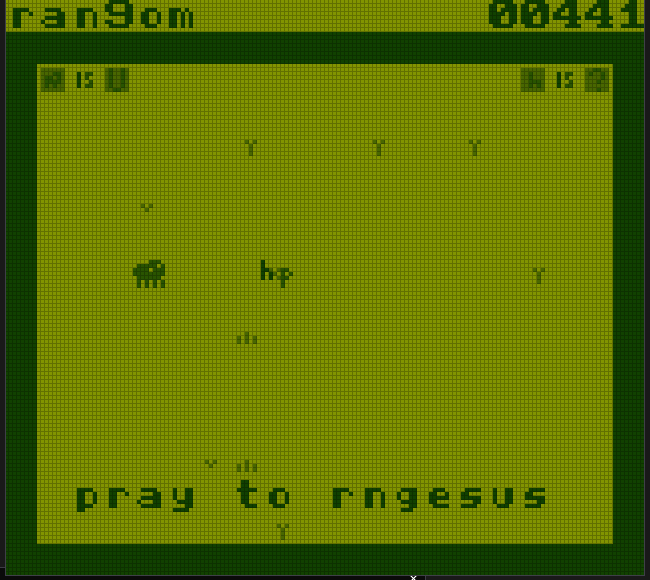

In the array list above there is no entry for "random", since it can occupy other rules based on the last 8 frames of input.

A decompilation (using awake) of the function responsible for this can be seen here:

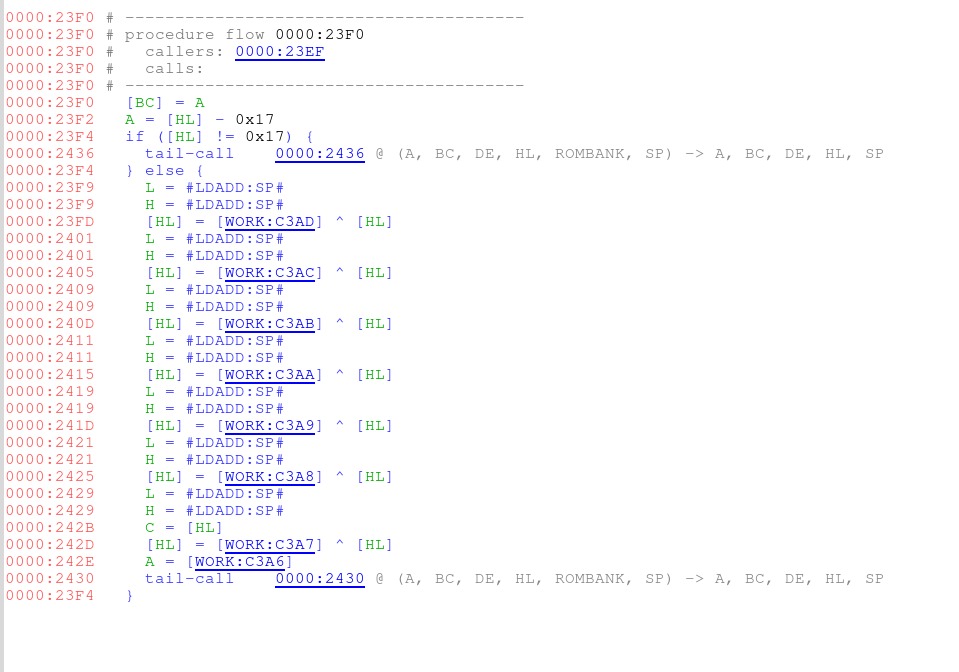

The rng takes the value of the random-symbol (0x17) and then XORes it byte by byte with the last 8 inputs. Win is 0x11, therefore the XOR of all 8 bytes must be 0x06. In the GameBoy, the inputs are passed as follows:

- J_DOWN = 0x08
- J_UP = 0x04
- J_LEFT = 0x02
- J_RIGHT = 0x01

Therefore, in the last 8 inputs there must be an uneven number of left and up keys. This can be easily done with the tas-emulator or by try and error when running against the flag with both buttons alternating.

## Flag

This results in the flag:

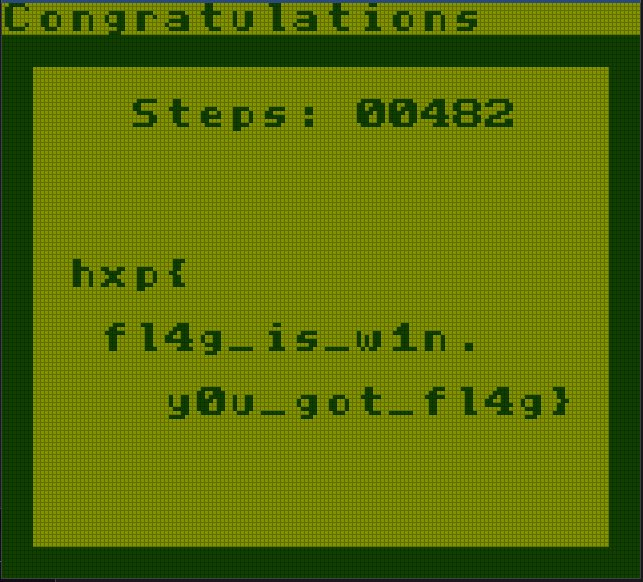

The solution replay is:

```.
H4sICPeeu2EC/3JlcGxheQDt2jGShSAAREG5jve/g9cyt7QKInWmX/KD/UEXCMjuHvsmSZIkSZK+0zAEkkXMyckpyXnIycnpPJSch5x/3ReNKCdn0Yo3oJycJU6D6b4ryf7NyclJKskq5uTklGQdcxpRzsIn1IBychpNThc0yf2M04hycnJycoYcSObdtZzTxIO6eHCad0jriJOTk9N5xMnJycnJySnJhsPJyRklNe+dUONpW6I0oKS2T9LEfUmSmw8nJyen9zVUTk4XXk5OTk5OTs6fvSeb90onpgeU0z2O0jLCdB5x2ucpbUycnJycnJycmJycnJycqJLsi6gB4+ni0wi1LxlRTE5OTlJOSOuIk5PTaJp2VPPO2UOVZGME5eTk5OR07+E0oKRZTtNu3kltSqSSbIygnJyclJycBpTTA0rJWb6MrCOPKCcnJydnoNNwcnJycnJSmnhOTk5OTgdn9QHv/3k5OTk5OTkd75QR8+7vMh5QUsNJaUA5OTk5OTk5Ob3Pc3JycnK6FnMmUTFtTJAeUE5OSkl2Rk5OTse3ZNfh5OR0dnNycoYseL//5+Tk5OTkzHufl2TL4XTvkfTuUr79HDNfKvhc/8Hlc/X78zJJD50NWZPoQFYBAA==
```
